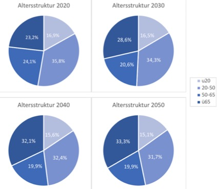

# Seniorenmarketing als Chance des demographischen Wandels

EINLEITUNG

In der Vergangenheit hat sich Marketing vor allem auf eine zielgruppenadäquate Ansprache jüngerer Generationen konzentriert. Pioniere im Bereich Seniorenmarketing wurden belächelt, da wirtschaftliche Stärke und Wachstum mit der jüngeren Bevölkerung assoziiert wurden (Meiners & Seeberger, 2010, S. 297). Dies fußte auf einem Stereotypenbild von Senioren, dass diese wegen geringer Vermögen als abhängig vom Einkommen ihrer Kinder darstellte (Meiners & Seeberger, 2010, S. 294).
Aufgrund eines höheren Bildungsgrades heutiger Senioren und daraus resultierenden unabhängigen Einkommensquellen wird nun beobachtet, dass die ältere Bevölkerung öfter als die jüngere langjährige Investitionen tätigt und verstärkt Güter höherer Qualität konsumiert (Meiners & Seeberger, 2010, S. 294). Und angesichts des demographischen Wandels, gemäß dessen die Generation 50plus ab 2040 mehr als die Hälfte der deutschen Bevölkerung bildet (Focus Money, 2010), wird evident, dass Senioren eine größere und wohlhabendere Zielgruppe der Zukunft darstellen.
Wegen der hohen Relevanz des demographischen Wandels und den daraus resultierenden Konsequenzen für Werbetreibende thematisiert diese Literaturarbeit die Forschungsfrage, welche Chancen sich durch den demographischen Wandel für zielgruppenspezifisches Seniorenmarketing ergeben. Dazu wird zuerst der Begriff „demographischer Wandel“ definiert und es werden entsprechende Daten für die Bundesrepublik Deutschland visualisiert, um danach auf die Zielgruppe der Senioren, deren Charakteristika und die daraus folgende Ansprache durch Marketingmaßnahmen einzugehen.
Zur Durchführung der vorliegenden Arbeit wird Primär- und Sekundärliteratur in Form von einzelnen Artikeln zur Darstellung spezifischer Erkenntnisse herangezogen. Weitere sekundärliterarische Monographien erklären einzelne Begrifflichkeiten. Statistiken dienen zur Veranschaulichung der Daten bezüglich des demographischen Wandels.
In der Schlussbetrachtung werden die Resultate dieser Seminararbeit zusammengefasst, Handlungsempfehlungen für die Praxis formuliert sowie auf Grenzen der Arbeit und weiteren Forschungsbedarf hinsichtlich des Seniorenmarketings hingewiesen.

DEMOGRAPHISCHER WANDEL

Im vorliegenden Kapitel wird demographischer Wandel definiert und es werden Prognosen für die Altersstruktur der kommenden Jahrzehnte in Deutschland gezeigt und beschrieben.

Definition

In einem Bericht des Bundesministeriums für Bildung und Forschung wird demographischer Wandel definiert als „die Veränderung der Alterszusammensetzung in einer Gesellschaft“ (Pack et al., 2000, S. 8). In Industriestaaten wird vorwiegend ein Rückgang der Bevölkerungszahlen sowie eine älter werdende Population verzeichnet, da sich die Lebenserwartung erhöht und Geburtenraten gleichzeitig stagnieren respektive abnehmen. Demographischer Wandel gilt demnach als Schwierigkeit, mit der sich Industriestaaten konfrontiert sehen, da er unter anderem aus der Entwicklung weg von der Agrargesellschaft und hin zu industriellen Strukturen und damit steigendem Wohlstand resultierte. Dem entgegen wirkt beispielsweise Immigration, wodurch sinkende Bevölkerungszahlen temporär in die Zukunft projiziert werden (Pack et al., 2002, S. 8).

Altersstruktur in Deutschland

In der vorliegenden Abbildung wird die prozentuale Verteilung verschiedener Altersgruppen in Deutschland in den Jahren 2020, 2030, 2040 und 2050 anhand von Kreisdiagrammen dargestellt. Die Legende beinhaltet die einzelnen Altersgruppen mit einer Altersangabe in Jahren:

(Quelle: eigene Darstellung in Anlehnung an Focus Money, 2010)

Abbildung 1: Entwicklung der Altersstruktur in Deutschland von 2020-2050

Die Haupterkenntnisse dieser Prognosen sind zum einen, dass die Gruppen der über 50-Jährigen ab 2040 mehr als 50% der Gesamtbevölkerung ausmachen. In Kapitel 3.1 wird dargelegt, dass die beiden Altersgruppen der über 50-Jährigen zu den Senioren gezählt werden. Zum anderen wird deutlich, dass lediglich die Gruppe der über 65-Jährigen einen prozentualen Zuwachs von insgesamt etwa zehn Prozentpunkten erfährt, während die relative Personenanzahl aller anderen Altersgruppen sinkt (Focus Money, 2010). Hierdurch wird evident, dass Seniorenmarketing aufgrund einer stetig wachsenden Zielgruppe zukünftig an Bedeutung gewinnt und dadurch Chancen für Unternehmen und ihr Marketing offeriert.

SENIORENMARKETING

Das folgende Kapitel beinhaltet eine Klärung der Zielsetzung von Seniorenmarketing, eine Definition der Zielgruppe, diverse Charakteristika dieser sowie die Art der Ansprache, die das Marketing wählt respektive wählen sollte, um erfolgreiche Werbemaßnahmen für Senioren zu implementieren.
Das in dieser Seminararbeit vorliegende Thema Seniorenmarketing verfolgt das Ziel, die der Zielgruppe zugehörigen Personen durch spezifische Werbung zu erreichen und so ihren Konsum zu steuern (Fritzsche, 2016, S. 14).

Definition der Zielgruppe

In der Literatur werden differenzierte Einteilungen diskutiert, die Senioren unterschiedliche Altersgruppen zuweisen. Vielen gemein ist jedoch, dass ein Mensch als Senior gilt, sobald er das 51. Lebensjahr erreicht (Fedorow, 2010, S. 12).
Die Grey Strategic Planning Agentur definiert Senioren gemäß biologischem Alter und unterteilt die Zielgruppe in drei Subkategorien: Die erste Subkategorie besteht aus den sogenannten Master Consumers. Diese sind 50 bis 59 Jahre alt und somit die jüngsten Zugehörigen der Zielgruppe der Senioren. Kennzeichnend für diese Teilgruppe sind körperliches Wohlergehen, ein reger Lebensstil sowie vergleichsweise hohe Einkünfte aufgrund der andauernden Berufstätigkeit. Subkategorie zwei bilden die sogenannten Maintainer. Mit einem Alter von 60 bis 69 Jahren sind sie die zweitjüngste Untergruppe der Senioren. Maintainern ergeht es körperlich ebenfalls gut, sie besitzen finanzielle Sicherheit und zeitbezogene Freiheiten, da sie laut Fedorow nicht mehr berufstätig sind. Die dritte Subkategorie der Senioren sind die sogenannten Simplifier mit einem Alter von über 70 Jahren. Diese Personen werden durch somatische Krankheiten, begrenzte Geldmittel sowie eine inaktivere Lebensweise charakterisiert (Fedorow, 2010, S. 12).
Eine andere Art der Unterteilung postuliert, dass sich Menschen im Alter von 51 bis 65 Jahren in einer Neuorientierungsphase befinden, die durch eine Änderung individueller Präferenzen, auch durch dann meist erwachsene Kinder, charakterisiert wird. Zwischen 66 und 79 sind Senioren der sogenannten Phase der Konsolidierung zuzuordnen, in der keine Berufstätigkeit ausgeübt wird und sinnstiftende Tätigkeiten sowie Gesundheit angestrebt werden. Die letzte sogenannte Phase des hohen Alters beginnt ab 80 Jahren. Senioren dieser Altersklasse bedürfen gemäß Literatur Pflege und Unterstützung (Auer-Srnka et al., 2008, S. 100).
Aufgrund der differenzierten Charakteristika innerhalb der Subkategorien der Senioren gilt es festzuhalten, dass die thematisierte Zielgruppe von Heterogenität geprägt ist (Nufer & Oexle, 2010, S. 8).

Charakteristika der Zielgruppe

Meiners und Seeberger beschreiben die heutige Zielgruppe der Senioren als eine, die fordernd, selbstbewusst, aktiv, erfahrungsorientiert, abenteuerlustig, zukunftsorientiert, genussliebend und konsumfreudig ist (Meiners & Seeberger, 2010, S. 299).
Letzteres Charakteristikum ist kohärent mit dem Postulat, dass „die Generation 50plus eine hohe Kaufkraft aufweist“ (Nufer & Oexle, 2010, S. 6). Dies wird damit begründet, dass Senioren autonomer entscheiden können, wie sie ihre Einkünfte verwenden, da sie im Gegensatz zu jüngeren Generationen bereits erwachsene, selbstständige Kinder haben und etwaige Finanzhilfen bereits beglichen worden sind (Nufer & Oexle, 2010, S. 6).
Aufgrund der mit fortschreitendem Alter einhergehenden physischen Eigenschaften zeigt die Zielgruppe der Senioren ein hohes Interesse an den Themen Medizin, Nahrung und Gesundheit. Eine marketingbezogene Ansprache ist in diesen Bereichen besonders erfolgreich, da diese die Aufmerksamkeit der Senioren erreicht (Helm et al., 2012, S. 434).
Physische Charakteristika von Senioren sind beispielsweise abnehmende Sehstärke oder geringere Bewegungsfähigkeit. Diese werden als Mängel empfunden, weshalb Senioren Produkte bedürfen, die solche Mängel zu verbessern versuchen (Helm et al., 2012, S. 435).
Eine letzte, konsumbezogene Eigenschaft der thematisierten Zielgruppe Senioren ist, dass diese, und vor allem ältere Subkategorien, durch das Ende der Berufstätigkeit häufiger einkaufen gehen, da darin eine abwechslungsreiche Tätigkeit mit menschlichen Interaktionen gesehen wird. Der Prozess des Einkaufens stellt demnach ein Substitut für die Berufstätigkeit dar (Helm et al., 2012, S. 436).

Ansprache der Zielgruppe

Um eine zielgruppenadäquate Ansprache zu gewährleisten, sollte Marketing anstatt des Alters die Selbsteinschätzung und die Passionen von Senioren fokussieren, denn die Betonung des biologischen Alters wird als abwertend aufgefasst (Auer-Srnka et al., 2008, S. 101). Werbung sollte vielmehr spezifische Informationen vermitteln, inwiefern ein Gut nützlich ist und das Wohlbefinden steigern kann (Auer-Srnka et al., 2008, S. 112).
Außerdem ist es zur erfolgreichen Werbegestaltung von Bedeutung, dass sich die Senioren mit den in der Ansprache verwendeten Testimonials identifizieren, da dies zur Nutzenschaffung eines Produktes beiträgt (Auer-Srnka et al., 2008, S. 101). Testimonials sind in einer Zielgruppe populäre und anerkannte Menschen, die die kommunikative Ansprache eines Gutes in der Werbung übernehmen und die Güte des Beworbenen bezeugen (Kittelmann, 2014, S. 5). Anzumerken ist hierbei, dass Testimonials im Bereich Seniorenmarketing ungefähr zehn Jahre jünger sein sollten, als die Zielgruppe selbst, da das empfundene Alter der heutigen Senioren geringer ist als das biologische (Nufer & Oexle, 2010, S. 13).
Im Gegensatz zu jüngeren Altersgruppen wird bei Senioren evident, dass diese sich vorrangig durch Werbemaßnahmen mit positiven Inhalten angesprochen fühlen. Dies trägt wiederum dazu bei, dass benannte Inhalte eher im Gedächtnis bleiben, was gleichbedeutend mit erfolgreichem Marketing ist (Helm et al., 2012, S. 434).
Eingehend auf die im Kapitel zuvor beschriebenen physischen Mängel von Senioren gilt es in der Werbeansprache, den daraus resultierenden Anforderungen gerecht zu werden. Beispielsweise sollten Produkte sowie deren Werbemaßnahmen eine größere Schriftgröße verwenden, um einer schwindenden Sehstärke entgegen zu wirken. Auch sollten Produkte im Geschäft an mittelhohen Stellen mit ausreichendem Raum in Zwischengängen platziert werden, um geringerer Bewegungsfähigkeit gerecht zu werden (Helm et al., 2012, S. 435).

SCHLUSSBETRACHTUNG

Im vorliegenden Kapitel werden die Erkenntnisse der Seminararbeit resümiert. Außerdem wird die Forschungsfrage, welche Chancen sich durch den demographischen Wandel für das Marketing ergeben, beantwortet. Schließlich werden die Grenzen der Arbeit sowie weiterer Forschungsbedarf im Seniorenmarketing aufgezeigt.
Durch den demographischen Wandel bedingt, zählt die Mehrheit der Deutschen zukünftig zu der Altersgruppe der Senioren. Diese leben in höherem Wohlstand und die daraus resultierende steigende Kaufkraft betont die Relevanz von Seniorenmarketing. Im Zuge dessen sollte sich das Marketing jedoch nicht auf das Alter, sondern auf Bedürfnisse des Alters sowie Produktnutzen konzentrieren und Produkte zielgruppengerecht designen.
Da Einkaufen bei Senioren als Zeitvertreib dient, ist hier die Handlungsempfehlung, diesen Prozess als Erlebnis und sozialen Treffpunkt zu gestalten. Zudem sollte Werbung auf den Tagesrhythmus von Senioren abgestimmt werden, um zur richtigen Uhrzeit und am richtigen Ort platziert zu werden und so erfolgreiches Marketing zu betreiben. Durch die Heterogenität der Zielgruppe der Senioren empfiehlt es sich, im Marketing unterschiedliche Schwerpunkte zu fixieren. Es bietet sich die Chance, jüngere Senioren vor allem durch das Thema Fitness und ältere Senioren durch das Thema Gesundheit anzusprechen. Schließlich sollte sich das Marketing die Digitalisierung zu Nutze machen, da heutige Senioren Affinität dazu aufzeigen (Meiners & Seeberger, 2010, S. 294).
In dieser Seminararbeit werden lediglich spezifische Charakteristika von Senioren dargestellt. Zudem werden nur einzelne Maßnahmen erklärt, wie Marketing Senioren erfolgreich anspricht. Daher ist die vorliegende Literaturarbeit als nicht ganzheitlich einzustufen. Zukünftige Forschung könnte differenzierte Eigenschaften und spezifische Ansprachemethoden für die einzelnen Subkategorien der Senioren ermitteln. Anhand dessen könnten weitere praxisrelevante Handlungsempfehlungen für das Marketing formuliert werden.

LITERATURVERZEICHNIS

Auer-Srnka, K.J., Meier-Pesti, K. & Grießmair, M. (2008). Ältere Menschen als Zielgruppe der Werbung: Eine explorative Studie zu Wahrnehmung und Selbstbild der „Best Ager“ sowie stereotypen Vorstellungen vom Alt-sein in jüngeren Altersgruppen. der markt. 47 (186), S. 99-115

Fedorow, R. (2010). Seniorenmarketing im Einzelhandel: Marketingstrategien zur Er- haltung und Neugewinnung von Kunden der Zielgruppe Best Ager (13. Auflage). Hamburg: Diplomica Verlag

Focus Money (2010). Prognostizierte Entwicklung der Altersstruktur in Deutsch-land von 2010 bis 2050 (in Millionen Einwohner). In Statista. Zugriff am 24.9.2019 unter [Statista](https://de.statista.com/statistik/daten/studie/163252/umfrage/prognose-der-altersstruktur-in-deutschland-bis-2050/)

Fritzsche, C. (2016). Seniorenmarketing: Marketing unter Einfluss des demografischen Wandels. Bachelor Thesis – Hochschule Mittweida

Helm, R., Scheunert, U. & Landschulze, S. (2012). Was wissen wir zum (Konsumenten-) Verhalten von Senioren? Betriebswirtschaft. 72 (5), S. 427-446

Kittelmann, D. (2014). Vom Fußballer zum Testimonial: Leistungskriterien von Bundesliga-Testimonials. Hamburg: Bachelor & Master Publishing, Diplomica Verlag

Meiners, N.H. & Seeberger, B. (2010). Marketing to Senior Citizens: Challenges and Opportunities. The Journal of Social, Political and Economic Studies. 35 (3), S. 293-328

Nufer, G., & Oexle, S. (2010). Marketing für Best ager. Kommunikationspolitik im 21. Jahrhundert. Reutlinger Diskussionsbeiträge zu Marketing & Management. 2010 (1), S. 1-19

Pack, J., Buck, H., Kistler, E., Mendius, H. G., Morschhäuser, M., & Wolff, H. (2000). Zukunftsreport demographischer Wandel. Innovationsfähigkeit in einer alternden Gesellschaft, Bonn

© Karolin Katharina Knobbe, 2019
